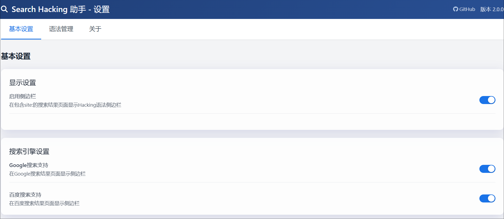
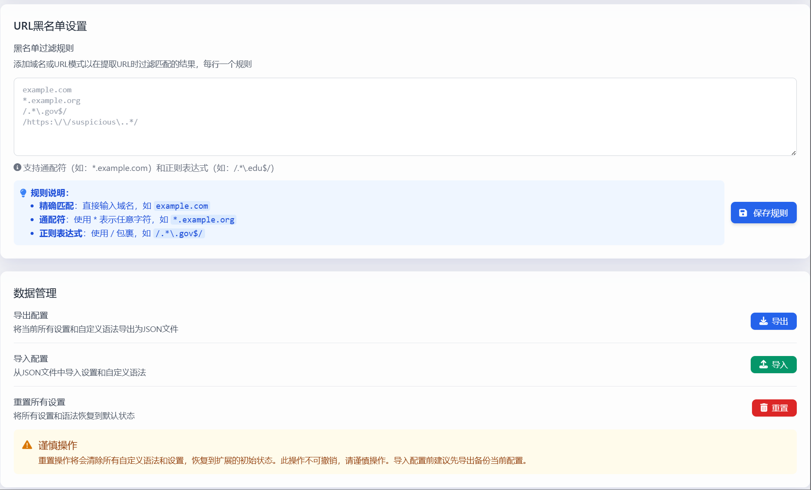
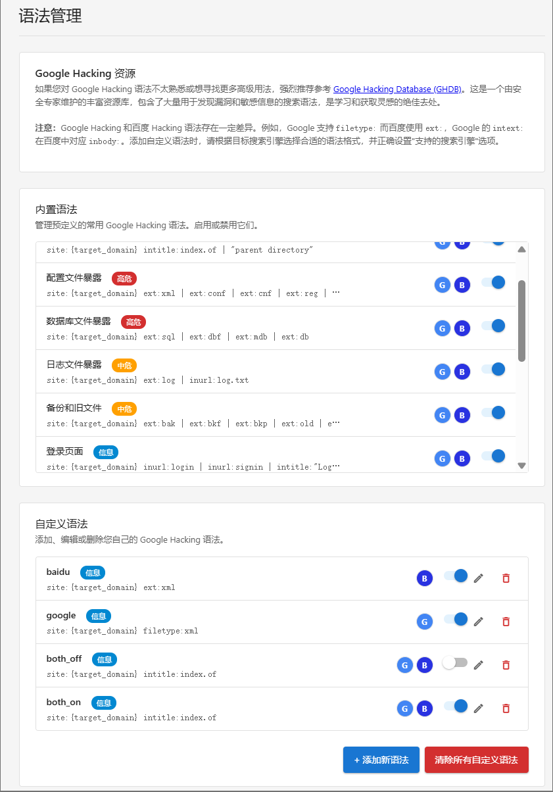
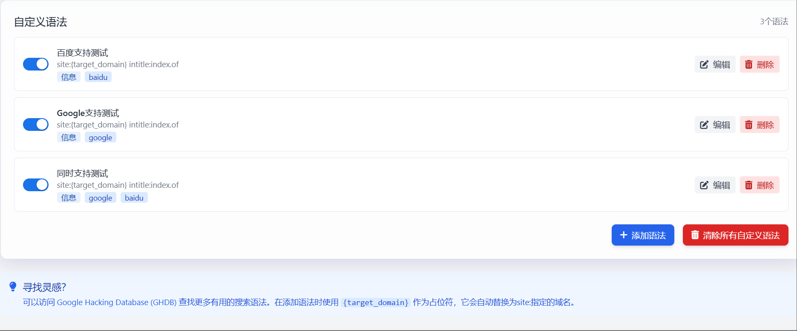
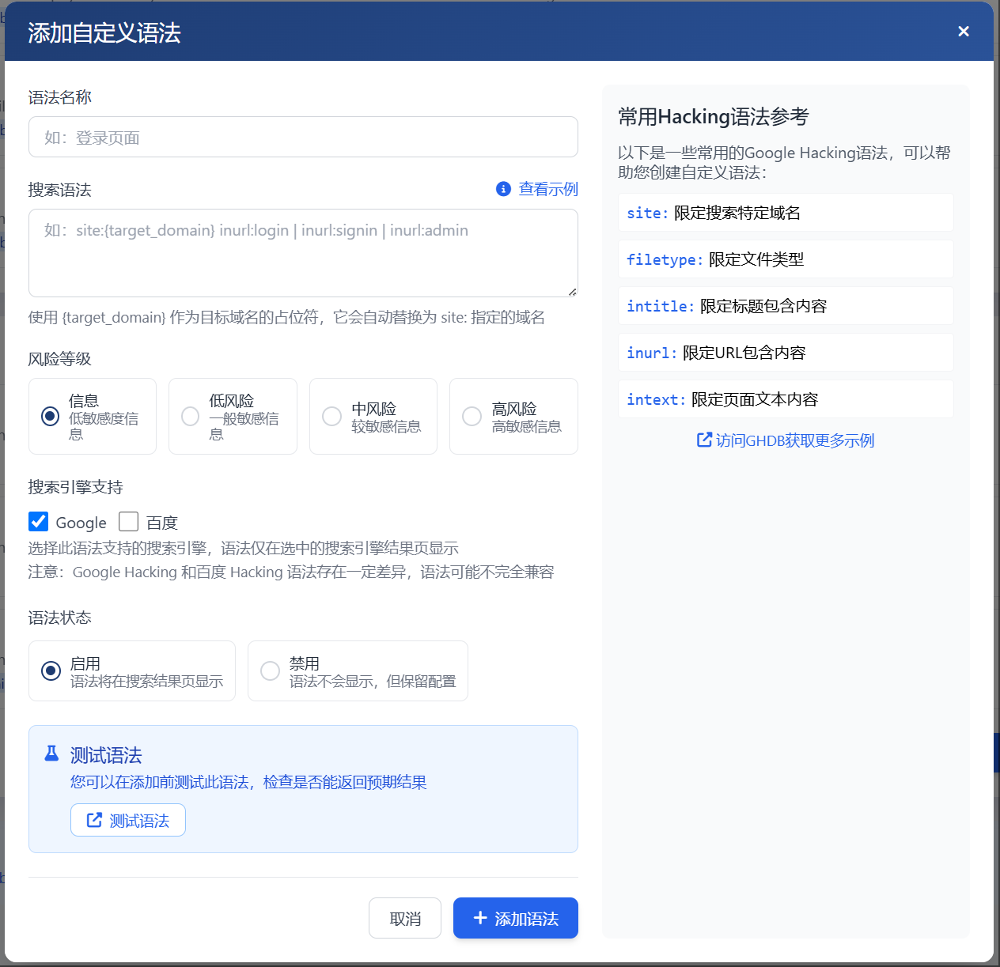
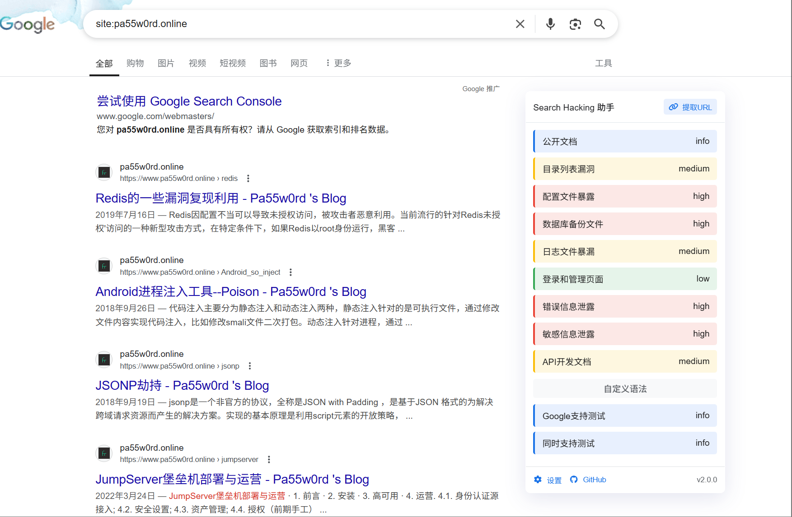
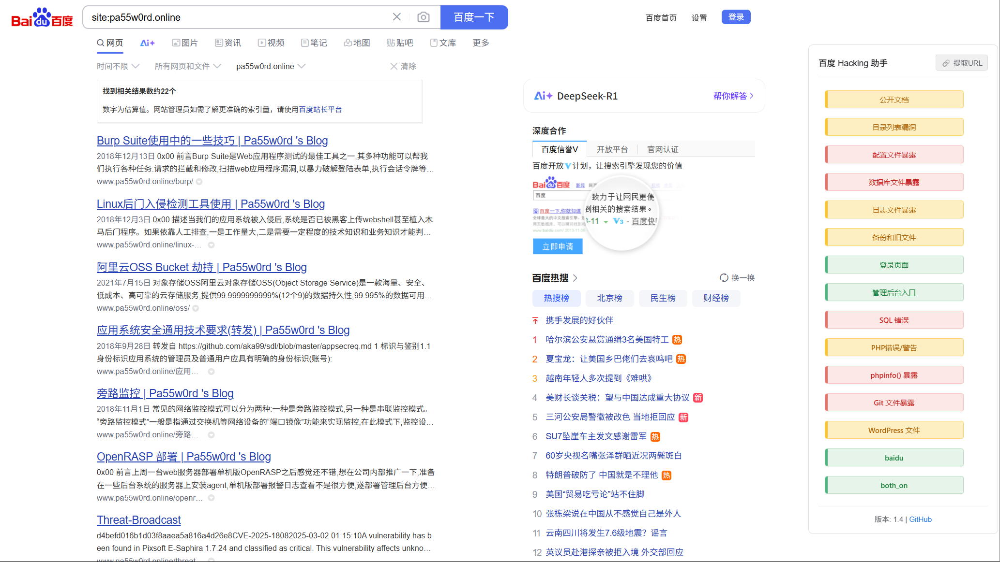
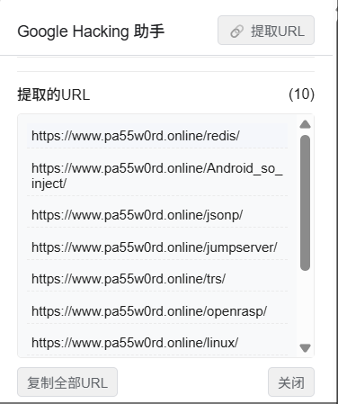

# Search Hacking Assistant 

**Professional Search Engine Hacking Syntax Tool**

**English | [中文](README.md)**

[Features](#-features) • [Installation](#-installation) • [Usage Guide](#-usage-guide) • [Contributing](#-contributing)

## 🔍 Product Overview

Search Hacking Assistant is a Chrome browser extension designed to simplify the process of using search engine hacking syntax for security researchers and penetration testers. It automatically injects a **fixed right-side** sidebar on Google, Baidu, and Bing search result pages containing `site:` queries, providing a series of predefined and customizable hacking syntax buttons. **Through flexible syntax configuration (with independent toggle switches for built-in and custom rules), you can easily create your own dedicated hacking toolkit**, executing advanced searches against target domains with just one click.

## ✨ Features

### 🎯 Smart Sidebar Injection
- **Auto Detection** - Automatically displays the hacking syntax sidebar only on search result pages containing `site:` queries
- **Fixed Position** - Always fixed on the right side of the page, without interfering with search result browsing
- **Real-time Updates** - Changes made in Popup or options page **(such as enabling/disabling sidebar, enabling/disabling syntax) are reflected in real-time on search pages** without manual refresh

### 🚀 Multi-Search Engine Support
- **Google Search** - Full support for Google global domains and country-specific versions
- **Baidu Search** - Optimized for Chinese environment, supporting Baidu-specific search syntax
- **Bing Search** - Support for Microsoft Bing global versions
- **Engine Control** - Display on search engines based on individual syntax configuration

### 📋 URL Extraction Tool
- **One-Click Extract** - Provides "Extract URLs" functionality to extract all URLs from current search results with one click
- **Smart Filtering** - Supports URL blacklist configuration to automatically filter unwanted domains from search results
- **Multiple Matching** - Supports exact matching, subdomain matching, and regular expression matching
- **Quick Copy** - Supports single copy or batch copy for further analysis of search results

### ⚙️ Highly Flexible Syntax Management
- **Built-in Syntax** - 9 carefully designed built-in syntax covering common security research scenarios
- **Custom Syntax** - Not only can you add, edit, and delete your own hacking syntax
- **Fine Control** - Independently enable or disable **each** built-in syntax and custom syntax to create a personalized hacking toolkit
- **Engine Selection** - Can select **supported search engines** for syntax, flexibly controlling syntax display on Google, Baidu, and Bing
- **Dynamic Replacement** - Automatically replaces `{target_domain}` placeholder in syntax with the domain specified by `site:` in current search query

### 🎨 User Experience Optimization
- **Zero Configuration Startup** - Ready to use after installation, no complex setup required
- **Modern Interface** - Adopts Material Design style, providing clean and intuitive user experience
- **Risk Level Indicators** - Syntax buttons are color-coded based on potential risk (High, Medium, Low, Info)
- **Quick Toggle** - Quickly enable or disable sidebar display through browser toolbar popup, or click "Open Settings" to enter options page
- **Flexible Settings** - Configure whether clicking syntax buttons opens search results in current tab or new tab in options page, customize URL click behavior

### 🛡️ Enhanced Stability
- **Protocol Compatibility** - Correctly handles domains with `http://` or `https://` protocol after `site:` directive (e.g., `site:https://example.com`)
- **Context Management** - Improved extension context management mechanism, effectively resolving flickering issues on Baidu dynamic pages for smoother user experience
- **Performance Optimization** - More precise DOM observer configuration, reducing CPU and memory usage, optimized debounce handling

### 🔒 Security & Privacy
- **Local Storage** - All data is stored only in user's browser locally
- **Zero Tracking** - Does not collect any user data or search history
- **Open Source Transparency** - Completely open source, code is publicly auditable
- **Minimal Permissions** - Only requests necessary browser permissions

## ⚠️ Important Notes

### Google, Baidu, and Bing Search Syntax Differences

While this extension supports Google, Baidu, and Bing search engines simultaneously, please note that there are some differences in search syntax among the three:

1. **Syntax Compatibility**:
   - Some advanced search syntax that works on Google may not work on Baidu or Bing, and vice versa
   - For example, directives like `intext:`, `intitle:` may behave differently across the three search engines

2. **Search Result Differences**:
   - Even using the same syntax, the three search engines may return significantly different results
   - This is due to their different index databases and search algorithms

3. **Syntax Combination Limitations**:
   - Baidu and Bing may not support complex syntax combinations as well as Google
   - When using multiple advanced directive combinations on Baidu or Bing, some directives may be ignored

It's recommended to choose the appropriate search engine based on your targets and needs when using this extension, and adjust syntax for different search engines. If a syntax doesn't work on a specific search engine, try simplifying the syntax or using alternative syntax specific to that search engine.

The built-in syntax of this extension has considered compatibility across the three search engines as much as possible, but please be aware of these differences when creating custom syntax.

## 🚀 Installation

Currently, you can load this extension from source code through the following steps:

1.  **Download Code**:
    *   Clone this repository: `git clone https://github.com/Pa55w0rd/google-hacking-assistant.git`
    *   Or download the repository ZIP file and extract it.
2.  **Open Chrome Extensions Page**: Enter `chrome://extensions/` in the browser address bar and press Enter.
3.  **Enable Developer Mode**: Find and turn on the "Developer mode" switch in the top right corner of the page.
4.  **Load Extension**: Click the "Load unpacked" button in the top left corner, then select the project folder you just downloaded and extracted (or cloned).
5.  Installation complete! You should see the extension icon in the browser toolbar.

## 📖 Usage Guide

### Basic Usage
1.  **Perform search containing `site:`**: Enter a query containing the `site:` directive in Google, Baidu, or Bing search box, such as `site:example.com test`, then press Enter to search.
2.  **Sidebar appears**: After the search results page loads, if the extension is enabled (enabled by default), you should see the **"Search Hacking Assistant" sidebar fixed on the right side** of the page.
    *   *Note*: If the search query doesn't contain the `site:` directive, the sidebar won't appear.
3.  **Click syntax buttons**: The sidebar will display all enabled built-in and custom syntax buttons that support the current search engine. Click the button you're interested in.
4.  **Execute hacking search**: The extension will automatically replace `{target_domain}` in the corresponding hacking syntax with `example.com`, then execute this new search in a new tab.

### Advanced Features
- **Extract URLs**: Click the "Extract URLs" button at the top of the sidebar, and the extension will extract all URLs from current search results, apply URL blacklist filtering, and display them in the sidebar's URL panel.
- **Manage Extension**:
    *   Click the extension icon in the browser toolbar to quickly toggle the "Enable Sidebar" status, or click "Open Settings" to enter the options page.
    *   In the options page, you can manage custom syntax (CRUD operations, enable/disable, select supported search engines), **enable/disable built-in syntax**, change link opening behavior, configure URL blacklist. **Make full use of syntax toggle functionality to customize your needed sidebar.**
    *   **All setting changes (enable/disable sidebar, syntax toggles) are applied in real-time to opened search pages without refresh.**

## 📸 Screenshots

**1. Popup Window**

*Popup window when clicking browser toolbar icon, for quick sidebar toggle and settings access.*

**2. Options Page - General Settings**

*Options page - General settings, configure sidebar toggle, URL extraction blacklist, import/export configuration, reset.*

**3. Options Page - Syntax Management**

*Options page - Syntax management, manage built-in and custom hacking syntax, select supported search engines.*

**4. Google Search Sidebar**

*Extension sidebar appears on the right side of Google search results page, providing one-click hacking functionality.*

**5. Baidu Search Sidebar**

*Extension sidebar on Baidu search results page, providing the same hacking functionality.*

**6. URL Extraction Feature**

*One-click extraction of all URLs from search results, supporting single or batch copy.*

## 📌 Adding or Editing Custom Syntax

This is the key to unleashing the powerful potential of Search Hacking Assistant! In addition to using built-in syntax, you can create and manage personalized hacking syntax according to your specific needs.

When adding or editing custom syntax, you can use the special placeholder `{target_domain}`. When you click the syntax button on a search results page (containing `site:example.com`), the extension will automatically replace `{target_domain}` in the syntax with `example.com`.

**Example:**

*   You saved a custom syntax: `site:{target_domain} inurl:admin`
*   You search `site:example.com` on Google, Baidu, or Bing
*   Click the above syntax button in the appearing sidebar
*   The extension will execute a new search: `site:example.com inurl:admin`

This allows you to create syntax once and conveniently execute that search against any target website specified through the `site:` directive.

### Supported Search Engine Settings

When adding or editing syntax, you can check the search engines (Google, Baidu, and/or Bing) that the syntax supports. The syntax will only appear in the sidebar of the search engine result pages you specify. This allows you to customize different syntax sets for different search engines.

### URL Blacklist Configuration

In v2.0, you can configure URL blacklist to filter URLs in search results. The blacklist supports the following matching modes:

1. **Regular Domain Matching**: Directly enter domain name, such as `example.com`, will match the domain and all its subdomains
2. **Wildcard Subdomain Matching**: Use format `*.example.com`, will only match subdomains of `example.com`, but not `example.com` itself
3. **Regular Expression Matching**: Use format `/pattern/`, will use regular expressions to match URLs, providing the most flexible filtering method

URL blacklist is particularly useful for the "Extract URLs" feature, helping you filter out unwanted results and focus on valuable target URLs.

### Learning & Inspiration: Google Hacking Database (GHDB)

For hacking syntax itself, if you're not familiar with it or want to find more interesting usage, we strongly recommend checking out the [Google Hacking Database (GHDB) on Exploit DB](https://www.exploit-db.com/google-hacking-database). This is a huge treasure trove containing numerous search syntax for discovering vulnerabilities and sensitive information, and is a great place to learn and get inspiration for custom syntax.

## 📊 Use Cases

### Security Research
- **Vulnerability Discovery** - Quickly discover security issues on target websites
- **Information Gathering** - Efficiently collect public information about targets
- **Threat Intelligence** - Search for related security threat information

### Penetration Testing
- **Reconnaissance Phase** - Automated information gathering and target analysis
- **Vulnerability Assessment** - Quickly identify potential security risk points
- **Report Generation** - Batch extract URLs for testing reports

### Security Education
- **Learning Tool** - Help students understand Google Hacking techniques
- **Practice Platform** - Provide safe practice environment
- **Knowledge Sharing** - Built-in syntax library as learning reference

## 🛡️ Built-in Syntax Library

### Universal Syntax (All Search Engines)
| Syntax Category | Risk Level | Purpose |
|----------------|------------|---------|
| Document Files | Info | Find common documents like PDF, DOC, PPT |
| Configuration Files | High Risk | Find XML, INI, ENV configuration files |
| Backup Files | High Risk | Discover SQL, BAK backup files |
| Login Pages | Low Risk | Discover login and admin portals |

### Google Syntax
| Syntax Category | Risk Level | Purpose |
|----------------|------------|---------|
| Directory Listings | Medium Risk | Leverage Google's intitle advantage to find directory traversal |
| Error Messages | High Risk | Find various program error messages |
| PHP Info | High Risk | Discover phpinfo page leaks |

### Baidu Syntax
| Syntax Category | Risk Level | Purpose |
|----------------|------------|---------|
| Chinese Sensitive Info | Medium Risk | Search for sensitive information in Chinese environment |
| Log Files | Medium Risk | Find log file leaks |

### Bing Syntax
| Syntax Category | Risk Level | Purpose |
|----------------|------------|---------|
| Document Content Search | High Risk | Use contains syntax for deep document content search |
| API Documentation | Medium Risk | Find API documentation and interface information |

## 📈 Development Roadmap
- Build complete security research tool ecosystem
- Integrate AI-assisted intelligent syntax recommendations
- Support team collaboration and configuration synchronization

## 🤝 Contributing

We welcome all forms of contributions!

### Reporting Issues
- Report bugs through [GitHub Issues](https://github.com/Pa55w0rd/google-hacking-assistant/issues)
- Provide detailed reproduction steps and environment information

### Feature Suggestions
- Propose new feature suggestions in Issues
- Describe the use cases and expected effects of the feature

### Code Contributions
1. Fork this repository
2. Create feature branch (`git checkout -b feature/AmazingFeature`)
3. Commit changes (`git commit -m 'Add some AmazingFeature'`)
4. Push to branch (`git push origin feature/AmazingFeature`)
5. Create Pull Request

## 📄 License

This project is licensed under the MIT License - see the [LICENSE](LICENSE) file for details

## ⚠️ Disclaimer

This tool is intended for legitimate security research and authorized penetration testing only. Users must comply with local laws and regulations and must not use it for any illegal activities. The developers assume no legal responsibility for any misuse of this tool.

## 📞 Contact Us

- **GitHub**: [@Pa55w0rd](https://github.com/Pa55w0rd)
- **Issues**: [Project Issues Page](https://github.com/Pa55w0rd/google-hacking-assistant/issues)

---
## 📜 Changelog

### v2.2.1

*   **Bug Fixes**: Fixed theme manager initialization issues and optimized syntax toggle notifications
    *   Fixed ThemeManager.init() call error in popup.js, changed to use correct global instance
    *   Fixed asynchronous message listener error in Chrome extension, resolved "A listener indicated an asynchronous response by returning true, but the message channel closed before a response was received" issue
    *   Fixed ThemeManager duplicate declaration error, added duplicate declaration check mechanism
    *   Optimized built-in syntax toggle notifications to display detailed syntax names and status information
    *   Optimized search engine toggle notifications to include syntax type and engine information
    *   Fixed search result count display issue, hidden by default, only shown when searching with match count

### v2.2

*   **Added Dark Mode**: Brand new dark mode functionality with automatic system theme preference detection and manual switching. All interfaces support dark mode with real-time theme synchronization.
*   **Optimized Import/Export Configuration**:
    *   Export configuration now includes dark mode settings for complete configuration backup
    *   Import configuration automatically applies theme settings for complete configuration restoration
    *   Enhanced import confirmation dialog showing detailed import information including theme settings
    *   Smart built-in syntax protection mechanism - import only updates toggle status without modifying content
    *   Support for custom syntax append and overwrite modes, providing more flexible import options

### v2.1.1

*   **Bug Fix**: Fixed the "Required value 'version' is missing or invalid" issue that occurred during Chrome extension installation.

### v2.1

*   **Bing Search Support**: Added full support for Bing search engine, enjoy the same functionality as Google and Baidu.
*   **Syntax Toggle Optimization**: Added syntax supported search engine options, allowing precise control of each syntax display in different search engines.

### v2.0

*   **Core Refactoring**: Completely refactored the underlying code, improving stability and performance.
*   **URL Blacklist**: Added URL blacklist functionality supporting three matching modes: domain, wildcard subdomain, and regular expression, effectively filtering URLs in search results.
*   **Stability Enhancement**:
    *   Optimized extension context management mechanism, resolving sidebar flickering issues on Baidu search pages
    *   Improved DOM listening strategy, reducing unnecessary sidebar rebuilds
    *   Enhanced error recovery capability, providing better user experience when extension context becomes invalid
*   **Performance Optimization**:
    *   More precise DOM observer configuration, reducing CPU and memory usage
    *   Optimized debounce handling, avoiding overly frequent operations
    *   Enhanced state management, avoiding duplicate injection and flickering issues
*   **UI Optimization**:
    *   Improved URL extraction panel user interface, providing clearer extraction status feedback
    *   Optimized error message display, more friendly display of possible problem causes

### v1.4

*   **Feature Enhancement**: Added "Extract URLs" functionality to extract all URLs from search results with one click, supporting single copy or batch copy for security researchers to further analyze search results.
*   **Interface Optimization**: Added visual feedback effects for URL extraction functionality, allowing users to intuitively understand operation status (extracting, extraction successful).
*   **Name Update**: As functionality continues to expand, the extension name was updated from "Google Hacking Assistant" to "Search Hacking Assistant" to better reflect multi-search engine support.
*   **Compatibility Optimization**: Optimized display effects on different search engine result pages, ensuring consistent user experience.

### v1.3

*   **Multi-Search Engine Support**: Added Baidu search support, now you can use hacking syntax on Baidu search result pages.
*   **Interface Optimization**: Added syntax supported search engine options, allowing selection of syntax display on Google and/or Baidu.

### v1.2

*   **Interface Optimization**: Added Google Hacking Database (GHDB) recommended resources section in the "Syntax Management" page, providing learning reference for users unfamiliar with Google Hacking.

### v1.1

*   **Feature Enhancement**: Compatible with domains containing `http://` or `https://` protocol after `site:` directive in Google search queries (such as site:https://example.com).

---

**If this project helps you, please give it a ⭐**

 